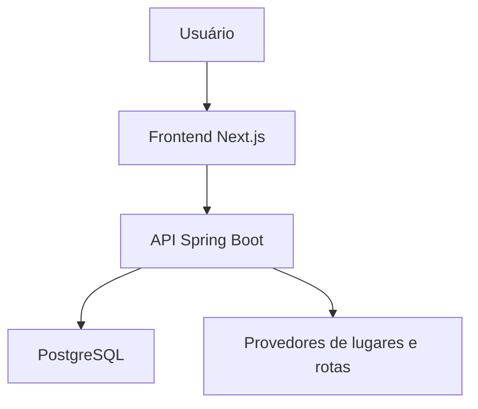

# Roteirize

> Seus lugares. Um roteiro que realmente cabe na viagem.

O **Roteirize** é uma plataforma web para transformar lugares de interesse em um roteiro diário possível, eficiente e fácil de ajustar.

A proposta não é apenas indicar atrações ou exibi-las em um mapa. O sistema organiza cada atividade considerando tempo disponível, deslocamentos, horários de funcionamento, reservas, prioridades e o ritmo dos viajantes.

## O problema

Planejar uma viagem normalmente exige reunir informações espalhadas em diferentes lugares:

- atrações salvas em mapas;
- horários encontrados em sites;
- reservas recebidas por e-mail;
- distâncias e tempos de deslocamento;
- anotações pessoais;
- prioridades dos viajantes;
- disponibilidade em cada dia.

Mesmo com todas essas informações, ainda é necessário decidir:

- quais lugares visitar em cada dia;
- em qual ordem visitá-los;
- quanto tempo reservar para cada atividade;
- como evitar deslocamentos desnecessários;
- como respeitar reservas e horários de funcionamento;
- o que fazer quando nem todas as atrações cabem na viagem.

Como resultado, muitos roteiros ficam cansativos, apresentam conflitos de horário ou incluem mais atividades do que realmente podem ser realizadas.

## A solução

O Roteirize foi projetado para transformar preferências e restrições em uma programação diária organizada.

O usuário informa o destino, as datas, a hospedagem, os lugares que deseja conhecer e suas preferências. A partir dessas informações, o sistema monta um roteiro considerando:

- proximidade entre os lugares;
- tempo estimado de deslocamento;
- duração de cada visita;
- dias e horários de funcionamento;
- reservas com horário fixo;
- prioridade das atrações;
- horário de início e término dos passeios;
- pausas durante o dia;
- ritmo tranquilo, moderado ou intenso;
- atividades fixadas pelo usuário;
- equilíbrio entre os dias da viagem.

O resultado é apresentado como uma linha do tempo integrada a um mapa, acompanhada de conflitos, alertas e justificativas.

## Como funciona

1. **Criar a viagem**  
   O usuário informa a cidade, as datas, o ponto de hospedagem, o modo de deslocamento e o ritmo desejado.

2. **Adicionar lugares**  
   As atrações podem ser pesquisadas por nome ou cadastradas manualmente.

3. **Definir preferências**  
   Cada lugar pode receber duração estimada, prioridade, disponibilidade, observações e reserva com horário fixo.

4. **Gerar o roteiro**  
   O sistema distribui e ordena as atrações entre os dias disponíveis.

5. **Analisar o resultado**  
   O usuário visualiza horários, deslocamentos, alertas, conflitos e lugares que não puderam ser incluídos.

6. **Editar e recalcular**  
   Atividades podem ser movidas, reorganizadas ou bloqueadas. O roteiro pode ser recalculado preservando as escolhas manuais.

## Funcionalidades principais

### Gestão de viagens

- Cadastro e autenticação de usuários.
- Criação de viagens de uma a catorze dias.
- Organização das viagens por usuário.
- Definição de cidade, país, datas e hospedagem.
- Configuração dos horários disponíveis em cada dia.
- Escolha do ritmo e do modo de deslocamento.

### Lugares e atrações

- Pesquisa de cidades e lugares reais.
- Cadastro manual de atrações.
- Visualização de endereço e localização no mapa.
- Definição de duração estimada da visita.
- Prioridade de cada atração.
- Dias e horários disponíveis.
- Reservas e compromissos fixos.
- Observações personalizadas.

### Planejamento inteligente

- Distribuição das atrações entre os dias.
- Agrupamento de lugares próximos.
- Redução de deslocamentos desnecessários.
- Respeito aos horários de funcionamento.
- Preservação de reservas e atividades bloqueadas.
- Equilíbrio da quantidade de atividades por dia.
- Identificação de atrações que não cabem na programação.
- Geração de justificativas para as decisões do sistema.

### Visualização e edição

- Linha do tempo separada por dia.
- Mapa com os pontos e a ordem de visita.
- Horários previstos de chegada e saída.
- Tempo de visita e deslocamento.
- Destaque para reservas, bloqueios e conflitos.
- Reorganização manual das atividades.
- Recálculo de um dia ou do roteiro completo.
- Interface adaptada para computador e celular.

## Inteligência de planejamento

O Roteirize combina características de roteamento, agendamento e otimização com múltiplos critérios.

O objetivo não é encontrar um roteiro matematicamente perfeito, mas produzir uma programação:

- possível de executar;
- rápida de calcular;
- eficiente nos deslocamentos;
- compatível com as preferências do usuário;
- explicável;
- fácil de modificar.

Restrições obrigatórias, como uma reserva com horário marcado, não podem ser ignoradas apenas para aumentar a quantidade de atrações planejadas.

Quando uma atividade não puder ser incluída, o sistema deverá informar o motivo, por exemplo:

- não funciona nos dias disponíveis;
- não existe tempo suficiente para a visita;
- entraria em conflito com uma reserva;
- exigiria um deslocamento incompatível;
- possui prioridade menor que outras atrações.

A inteligência do planejamento é baseada em regras, dados geográficos e técnicas de otimização. O projeto não depende de inteligência artificial generativa para montar ou explicar os roteiros.

## Princípios do produto

- **O usuário continua no controle:** o sistema sugere e explica, mas o usuário decide.
- **Viabilidade antes de quantidade:** um roteiro menor e possível é melhor que uma agenda impossível.
- **Decisões importantes devem ser explicáveis.**
- **Alterações manuais devem ser preservadas quando solicitado.**
- **Informações incertas devem ser sinalizadas.**
- **O planejamento deve funcionar de maneira progressiva.**
- **Falhas em serviços externos não devem inutilizar todo o produto.**

## Escopo inicial

A primeira versão do Roteirize terá foco no planejamento individual de viagens turísticas:

- uma cidade por viagem;
- duração de uma a catorze dias;
- conta individual;
- pesquisa e cadastro de atrações;
- planejamento automático e manual;
- mapa e linha do tempo;
- identificação de conflitos;
- bloqueios e recálculo;
- execução local.

Não fazem parte do escopo inicial:

- compra de passagens, hotéis ou ingressos;
- viagens com múltiplas cidades;
- planejamento de voos e conexões;
- transporte público em tempo real;
- divisão de despesas;
- rede social de viajantes;
- aplicativo móvel nativo;
- marketplace de roteiros.

## Arquitetura

O projeto segue inicialmente uma arquitetura de **monólito modular**, com frontend e backend separados.



As integrações externas serão protegidas por adaptadores. Dessa forma, o sistema poderá trocar o provedor de mapas, geocodificação ou rotas sem espalhar dependências externas pelo restante do código.

Chaves privadas e regras de negócio permanecerão no backend. O frontend será responsável pela experiência visual e pela comunicação com a API.

## Tecnologias

### Frontend

- Next.js;
- React;
- TypeScript;
- CSS Modules.

### Backend

- Java;
- Spring Boot;
- API REST;
- Maven;
- validação de dados;
- testes unitários e de integração.

### Dados e infraestrutura

- PostgreSQL;
- Docker Compose;
- migrações de banco de dados;
- integração contínua com GitHub Actions;
- variáveis de ambiente para configurações e segredos.

### Integrações

- autocomplete e geocodificação;
- pesquisa de lugares;
- mapas;
- cálculo de rotas e deslocamentos.

## Estrutura do repositório

```text
roteirize/
├── backend/       # API, domínio e regras de negócio
├── frontend/      # Interface web
├── docs/          # Documentação funcional e técnica
└── README.md
```

## Documentação

A documentação completa está organizada por domínio em [docs/README.md](docs/README.md).

As principais áreas documentadas são:

- produto e negócio;
- requisitos e regras;
- domínio e dados;
- arquitetura e algoritmo;
- API e integrações;
- frontend e experiência;
- autenticação, segurança e privacidade;
- estratégia de testes;
- ambiente local e integração contínua;
- backlog e planejamento.

## Objetivo educacional

Além de construir um produto útil, o Roteirize também é um projeto de aprendizado prático em engenharia de software.

Seu desenvolvimento envolve:

- desenvolvimento full stack;
- criação e consumo de APIs REST;
- autenticação e autorização;
- modelagem relacional;
- integração com serviços externos;
- algoritmos de agrupamento e ordenação;
- testes automatizados;
- segurança e privacidade;
- Docker e integração contínua;
- Git, branches e pull requests;
- documentação e decisões arquiteturais.

## Licença

Este projeto está sob a MIT License.